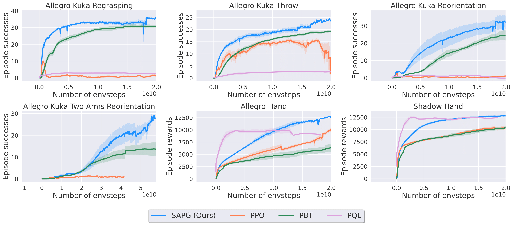

# SAPG: Split and Aggregate Policy Gradients (ICML 2024 Oral) 
[](https://arxiv.org/abs/2407.20230)
[](https://sapg-rl.github.io)
[](https://www.python.org)
[](https://opensource.org/licenses/MIT)

This repository contains the official implementation for the algorithm **Split and Aggregate Policy Gradients**. 

## Performance of SAPG



We evaluate SAPG on a variety of complex robotic tasks and find that it outperforms state-of-the-art algorithms such as DexPBT [[1]](#1) and PPO [[2]](#2). In all environments, SAPG obtains the highest asympototic successes/reward, while also being most sample-efficient in nearly all situations. 

## Training
Use one of the following commands to train a policy using SAPG for any of the IsaacGym environments

```bash
conda activate sapg
export LD_LIBRARY_PATH=$(conda info --base)/envs/sapg/lib:$LD_LIBRARY_PATH
# For Allegro Kuka tasks - Reorientation, Regrasping and Throw
./scripts/train_allegro_kuka.sh <TASK> <EXPERIMENT_PREFIX> 1 <NUM_ENVS> [] --sapg --lstm --num-expl-coef-blocks=<NUMBER_OF_SAPG_BLOCKS> --wandb-entity <ENTITY_NAME> --ir-type=entropy --ir-coef-scale=<ENTROPY_COEFFICIENT_SCALE>

# For Allegro Kuka Two Arms tasks - Reorientation and Regrasping
./scripts/train_allegro_kuka_two_arms.sh <TASK> <EXPERIMENT_PREFIX> 1 <NUM_ENVS> [] --sapg --lstm --num-expl-coef-blocks=<NUMBER_OF_SAPG_BLOCKS> --wandb-entity <ENTITY_NAME> --ir-type=entropy --ir-coef-scale=<ENTROPY_COEFFICIENT_SCALE>

# For Shadow Hand and Allegro Hand
./scripts/train.sh <ENV> <EXPERIMENT_PREFIX> 1 <NUM_ENVS> [] --sapg --lstm --num-expl-coef-blocks=<NUMBER_OF_SAPG_BLOCKS> --wandb-entity <ENTITY_NAME> --ir-type=entropy --ir-coef-scale=<ENTROPY_COEFFICIENT_SCALE>
```

### Distributed training

The code supports distributed training too. The template for multi-GPU training is as follows

```bash
# Distributed training for the AllegroKuka tasks 
./scripts/train_allegro_kuka.sh <TASK> <EXPERIMENT_PREFIX> <NUM_PROCESSES> <NUM_ENVS_PER_PROCESS> [] --sapg --lstm --num-expl-coef-blocks=<NUMBER_OF_SAPG_BLOCKS> --wandb-entity <ENTITY_NAME> --ir-type=entropy --ir-coef-scale=<ENTROPY_COEFFICIENT_SCALE> --multi-gpu
```

## Inference
To visualize performance of one of your checkpoints, execute run the following commands

```bash
conda activate sapg
export LD_LIBRARY_PATH=$(conda info --base)/envs/sapg/lib:$LD_LIBRARY_PATH
python3 play.py --checkpoint <PATH_TO_CHECKPOINT> --num_envs <NUM_ENVS>
```

**Note**: The path to the checkpoint must be its original path when the checkpoint was created to ensure that evaluation can be run using the correct config. 

## Quickstart

Clone the repository and create a Conda environment using the ```env.yaml``` file.
```bash
conda env create -f env.yaml
conda activate sapg
```

Download the Isaac Gym Preview 4 release from the [website](https://developer.nvidia.com/isaac-gym) and executing the following after unzipping the downloaded file
```bash
cd isaacgym/python
pip install -e .
```

Now, in the root folder of the repository, execute the following commands,
```bash
cd rl_games
pip install -e . 
cd ..
pip install -e .
```

### Reproducing performance
 
We provide the exact commands which can be used to reproduce the performance of policies trained with SAPG as well as PPO on different environments

```bash
# Allegro Kuka Regrasping
./scripts/train_allegro_kuka.sh regrasping "test" 1 24576 [] --sapg --lstm --num-expl-coef-blocks=6 --wandb-entity <ENTITY_NAME> --ir-type=none

./scripts/train_allegro_kuka.sh regrasping "test" 1 24576 [] --lstm --wandb-entity <ENTITY_NAME> # PPO

# Allegro Kuka Throw
./scripts/train_allegro_kuka.sh throw "test" 1 24576 [] --sapg --lstm --num-expl-coef-blocks=6 --wandb-entity <ENTITY_NAME> --ir-type=none

./scripts/train_allegro_kuka.sh throw "test" 1 24576 [] --lstm --wandb-entity <ENTITY_NAME> # PPO

# Allegro Kuka Reorientation
./scripts/train_allegro_kuka.sh reorientation "test" 1 24576 [] --sapg --lstm --num-expl-coef-blocks=6 --wandb-entity <ENTITY_NAME> --ir-type=entropy --ir-coef-scale=0.005

./scripts/train_allegro_kuka.sh reorientation "test" 1 24576 [] --lstm --wandb-entity <ENTITY_NAME> # PPO

# Allegro Kuka Two Arms Reorientation (Multi-GPU run)
./scripts/train_allegro_kuka_two_arms.sh reorientation "test" 6 4104  [] --sapg --lstm --num-expl-coef-blocks=6 --wandb-entity <ENTITY_NAME> --ir-type=entropy --ir-coef-scale=0.002 --multi-gpu

./scripts/train_allegro_kuka_two_arms.sh reorientation "test" 6 4104  [] --lstm --wandb-entity <ENTITY_NAME> --multi-gpu # PPO

# In-hand reorientation with Shadow Hand
./scripts/train.sh shadow_hand "test" 1 24576 [] --sapg --num-expl-coef-blocks=6 --wandb-entity <ENTITY_NAME> --ir-type=entropy --ir-coef-scale=0.005

./scripts/train.sh shadow_hand "test" 1 24576 [] --wandb-entity <ENTITY_NAME> # PPO

# In-hand reorientation with Allegro Hand
./scripts/train.sh allegro_hand "test" 1 24576 [] --sapg --num-expl-coef-blocks=6 --wandb-entity <ENTITY_NAME> --ir-type=none

./scripts/train.sh allegro_hand "test" 1 24576 [] --wandb-entity <ENTITY_NAME> # PPO

```

## Citation
If you find our code useful, please cite our work
```
@inproceedings{sapg2024,
  title     = {SAPG: Split and Aggregate Policy Gradients},
  author    = {Singla, Jayesh and Agarwal, Ananye and Pathak, Deepak},
  booktitle = {Proceedings of the 41st International Conference on Machine Learning (ICML 2024)},
  month     = {July},
  year      = {2024},
  publisher = {PMLR},
}
```

## Acknowledgements
This implementation builds upon the the following codebases - 
1. [IsaacGymEnvs](https://github.com/isaac-sim/IsaacGymEnvs)
2. [rl_games](https://github.com/Denys88/rl_games)

## References

<small><small>
<a id="1">[1]</a> 
Petrenko, A., Allshire, A., State, G., Handa, A., & Makoviychuk, V. (2023). DexPBT: Scaling up Dexterous Manipulation for Hand-Arm Systems with Population Based Training. ArXiv, abs/2305.12127.
<a id="2">[2]</a>
Schulman, J., Wolski, F., Dhariwal, P., Radford, A., & Klimov, O. (2017). Proximal Policy Optimization Algorithms. ArXiv, abs/1707.06347.
</small></small>